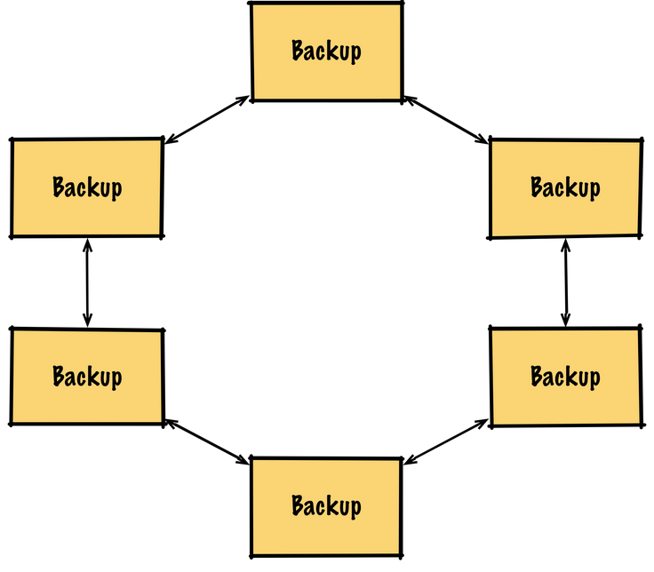
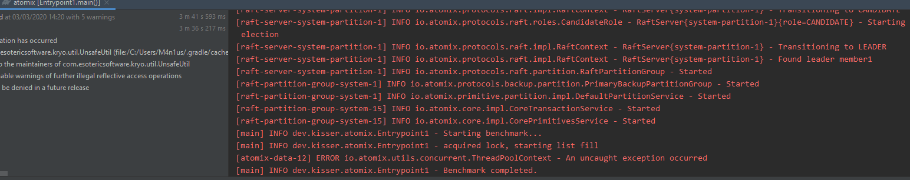
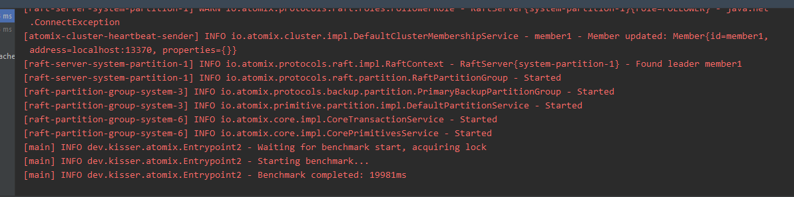

# SYT GEK103x Datamanagement "Distributed Data Structures"

## Einführung

Komplexe und aufteilbare Tasks müssen mit Parametern ausgestattet  werden und von entsprechenden Koordinatoren gestartet bzw. die  erhaltenen Daten wieder zusammengefasst werden. Diese Art von verteilter Programmierung findet in vielen Anwendungsgebieten rege Verwendung (AI  Daten Analyse, Lastverteilung, etc.). Hierbei kommt das Prinzip des  Master/Worker Patterns (Master-Slave oder Map-Reduce Pattern) zum  Einsatz.

## Ziele

Finden Sie eine Lösung, die in einer Cloud-Umgebung ausrollbar  (deployable) ist. Die einzelnen Worker sollen unabhängig voneinander  bestehen können und mit Input-Parametern gestartet werden. Die  berechneten Daten müssen an den Master bzw. als Zwischenberechnung an  andere Worker weitergegeben werden können. Die einzelnen Worker sollen  unabhängig von der Umgebung gestartet werden können (unterschiedliche  Servereinheiten).

## Voraussetzungen

- Grundverständnis von Python oder Java
- Lesen und Umsetzen von APIs
- Fähigkeit komplexe Programmier-Aufgaben zu implementieren und zu verteilen

## Detailierte Ausgabenbeschreibung

Recherchieren Sie mögliche Werkzeuge für das "distributed Computing". Vergleichen Sie mögliche Produkte in Bezug auf folgende Parameter:

- Architektur
- einsetzbare Programmiersprachen
- Datenverteilung und gemeinsamer Speicher
- Performance bei Main-Focus
- Notifikation von Master oder anderen Slaves

Nehmen Sie eine komplexe Aufgabenstellung/Berechnung und zeigen Sie  anhand von einer Beispiel-Konfiguration, wie die Verteilung der  Berechnung und anschließende Zusammenführung der Daten funktioniert. Bei ähnlichen oder gleichen Berechnungen wäre ein direkter Vergleich  (Benchmark) der gewählten Tools/Technologien von Vorteil.

## Bewertung

Gruppengrösse: 1 Person

### Grundlegende Anforderungen **überwiegend erfüllt**

- Vergleich von Technologien

### Grundlegende Anforderungen **zur Gänze erfüllt**

- Einsatz eines Beispiels zur Veranschaulichung der Funktionsweise

### Erweiterte Anforderungen **überwiegend erfüllt**

- Einsatz einer zweiten Implementierung

### Erweiterte Anforderungen **zur Gänze erfüllt**

- Benchmark von zwei verschiedenen Technologien

## Quellen

- "A reactive Java framework for building fault-tolerant distributed systems" Atomix [github](https://github.com/atomix/atomix)
- "What is Atomix?" [atomix.io](https://atomix.io/docs/latest/user-manual/introduction/what-is-atomix/)
- "Introduction to Atomix" [baeldung](https://www.baeldung.com/atomix)
- "Primitive Protocols" [atomix.io](https://atomix.io/docs/latest/user-manual/primitives/primitive-protocols/)
- "The Raft Consensus Algorithm" [online](https://raft.github.io/)
- "In Search of an Understandable Consensus Algorithm" Raft-Paper; Stanford University; [online](https://raft.github.io/raft.pdf)
- "How to Create a distributed Datastore in 10 Minutes" Jonathan Halterman [online](https://jodah.net/create-a-distributed-datastore-in-10-minutes)
- "Spark Quickstart" [online](http://spark.apache.org/docs/latest/quick-start.html)
- "Spark Github repository with examples" [online](https://github.com/apache/spark)
- "Spark Tutorial: Real Time Cluster Computing Framework" [online](https://www.edureka.co/blog/spark-tutorial/)
- "Apache Spark Dockerimage" [online](https://github.com/gettyimages/docker-spark)
- "Open-source software for reliable, scalable, distributed computing" [Apache Hadoop](https://hadoop.apache.org/)
- "High-performance coordination service for distributed applications" [Apache Zookeeper](https://zookeeper.apache.org/doc/current/)
- "Distributed data store" [wikipedia](https://en.wikipedia.org/wiki/Distributed_data_store)
- "Understanding Hadoop v/s Spark v/s Storm" [cognixia.com](https://www.cognixia.com/blog/understanding-hadoop-vs-spark-vs-storm)
- "Comparison Storm and Spark" [whizlabs.com](https://www.whizlabs.com/blog/apache-storm-vs-apache-spark/)
- "etcd - A distributed, reliable key-value store" [online](https://etcd.io/)


# Research

## Vergleich

### Atomix [1, 2]

Atomix ist ein Framework um fehlertolerante verteilte Systeme zu entwickeln. Dazu werden Cluster eingesetzt. Dafür gibt es ein Clustermanagement, welches dazu da ist um Fehler zu erkennen und evtl reagieren zu können (Downtimes etc)

Die Kommunikation zwischen den Clustern geschieht mit Netty, wobei direkte Kommunikation oder auch das Pub-Sub Prinzip angewendet werden.

Atomix ermöglicht auch die Verwendung von verteilten Datenstrukturen wie Maps, Sets, Trees, Counters oder Werten. Die Koordination kann über verteile Locks, Semaphoren oder Elections zur Bestimmung der Master/Slaves.

#### Programmierspachen

Für Atomix gibt es CLI Bindings. Hauptsächlich ist das Framework jedoch für Java ausgelegt. Es gibt jedoch auch nicht aktuell gehaltene Python Bindings.

#### Architektur/Datenverteilung

Atomix bietet Cluster an. Ein Cluster kann aus mehreren Nodes bestehen die sich hauptsächlich durch die Konfiguration wie die Datenreplikation unterscheiden.

Für die Replikation stehen mehrere Protokolle als Dependencies zur Verfügung.

* `atomix-raft` - (stark konsistenter partitionierter Konsensalgorithmus)
* `atomix-primary-backup` - (konsistenter partitionierter Master/slave basierter Replikationsalgorithmus)
* `atomix-gossip` - (hochskalierbares eventuell konsistentes Protokoll)

Diese unterscheiden sich je nach Anforderungen an Fehlertoleranz-, Konsistenz- oder Persistenz-Anforderungen

Die Grundarchitektur in Atomix ist das Data-Grid.



Dabei werden die Daten je nach Protokoll auf allen Clustern verteilt. Dabei werden Lese und Schreibzugriffe auf allen Nodes verteilt. Hier können über Autodiscovery dynamisch Nodes hinzugefügt werden.


### Akka [3]

Akka ist eine Sammlung aus open-source libraries für widerstandsfähige, skalierbare Systeme.  Dabei kommt ein Aktoren Modell zum Einsatz.

## Implementierung

### Atomix

Atomix legt Wert auf das Orchestrieren und Verteilen von Daten. Daher ist ein Benchmark der Verteilgeschwindigkeit sinnvoll, da dies auch einen vergleichbaren Punkt bei anderen Frameworks bietet.

Das Aufsetzen war relativ einfach, da das System durch gradle dependencies einfach zu einem Java Projekt hinzugefügt werden kann. Die Node Konfiguration kann jedoch ohne Java stattfinden.

Dafür habe ich bei Atomix zwei Nodes in ein Cluster gegeben und sie mit dem Raft Konsens Algorithmus für die Konsistenz ausgestattet.

```java
AtomixBuilder builder = Atomix.builder();
        Atomix atomix;
        atomix = builder.withMemberId("member1")
                .withAddress("localhost:13370")
                .withMembershipProvider(BootstrapDiscoveryProvider.builder()
                        .withNodes(
                                Node.builder()
                                        .withId("member1")
                                        .withAddress("localhost:13370")
                                        .build(),
                                Node.builder()
                                        .withId("member2")
                                        .withAddress("localhost:13371")
                                        .build())
                        .build())
                .withManagementGroup(RaftPartitionGroup.builder("system")
                        .withNumPartitions(1)
                        .withMembers("member1", "member2")
                        .withDataDirectory(new File("./atomix/entry1"))
                        .build())
                .withPartitionGroups(
                        PrimaryBackupPartitionGroup.builder("data")
                                .withNumPartitions(32)
                                .build())
                .build();

        atomix.start().join();
```

Da die gesamte Infrastruktur statisch ist, reicht für diesen kleinen Test ein lokaler BootstrapDiscoveryProvider. Dieser gibt die Daten an, welche Nodes wo zu finden sind. Man kann dies mit dynamischen Discovery Diensten ersetzten um so eben nicht gebunden zu sein.

Unter `.WithManagementGroup` wird eine Raft Systempartition gebaut. Achtung bei lokalem Betrieb wird hier für jede Node ein eigenes DataDirectory benötigt.

Der Code oben genügt um die Node in Betrieb zu nehmen.

`atomix.start().join();` sagt der Node das alles fertig konfiguriert ist und sie jetzt startet.

Die zweite Node die für die Zeitmessung zuständig ist, wird ähnlich wie oben konfiguriert, alleine die ID und das DataDirectory unterscheiden sich.

Atomix verwendet eigene sogenannte "Primitives" die verteilte Funktionalität bieten. So wird im Benchmark eine verteilte Liste als "Datastore" und ein Lock zum synchronisierten Start des Benchmarks erstellt.

```java
DistributedList<Object> list = atomix.listBuilder("kappa-list")
                .withElementType(String.class)
                .build();

DistributedLock lock = atomix.lockBuilder("kappa-lock").build();
```

Das Benchmark selbst besteht aus einfachem Abfragen, ob die Liste bereits groß genug ist (keine Tiefenüberprüfung ob die Objekte auch tatsächlich drüben sind)

```java
while(true){
	if(lock.isLocked()){
		break;
	}
}

log.info("Starting benchmark...");
Date start = new Date();
Date end;
while (true) {
	if (list.size() == benchmarkSize){
		end = new Date();
		break;
	}
}

long time = end.getTime() - start.getTime();
log.info("Benchmark completed: "+ time + "ms");
```

In der ersten Node wird auf die verteilten Objekte folgendermaßen zugegriffen

```java
DistributedList<Object> list = atomix.getList("kappa-list");
DistributedLock lock = atomix.getLock("kappa-lock");
```

Hier genügt der Name des Objektes, ähnlich wie bei vielen Message Queue Systemen.

Nun wird anschließend das Lock akquiriert 

```java
while(true){
	lock.tryLock();
	if(lock.isLocked()){
		break;
	}
}
```

und die Liste befüllt

```java
for(int i = 0; i < benchmarkSize; i++){
	list.add("Kappa-" + i);
}
lock.unlock();
log.info("Benchmark completed.");
```

Node1: Writing Node

Node2: Benchmarking Node

#### Akka [4]

Um mich mit Akka auseinanderzusetzen habe ich den "Akka Quickstart with Java" durchgearbeitet.


# Quellen

[1] "Atomix - What is Atomix?", zugegriffen am 27.2.2020 [online](https://atomix.io/docs/latest/user-manual/introduction/what-is-atomix/)

[2] "Atomix - Getting Started", zugegriffen am 27.2.2020 [online](https://atomix.io/docs/latest/getting-started/)

[3] "Introduction to Akka", zugegriffen am 3.3.2020 [online](https://doc.akka.io/docs/akka/current/typed/guide/introduction.html?language=java)

[4] "Akka Quickstart with Java", zugegriffen am 3.3.2020 [online](https://developer.lightbend.com/guides/akka-quickstart-java/)

